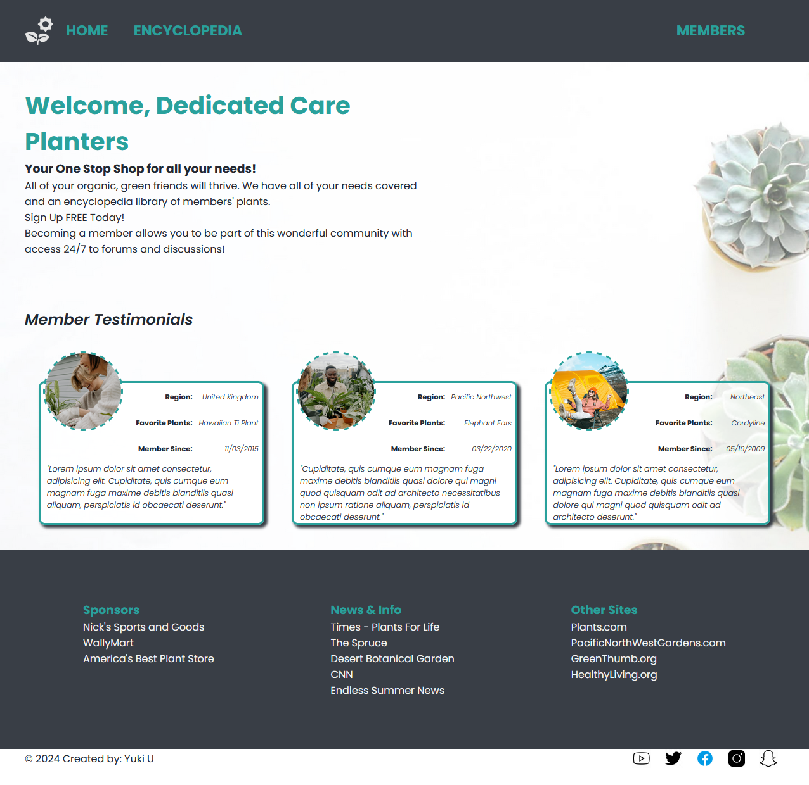
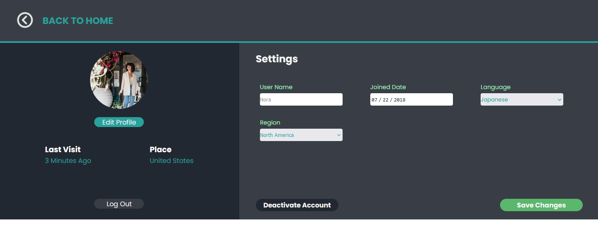
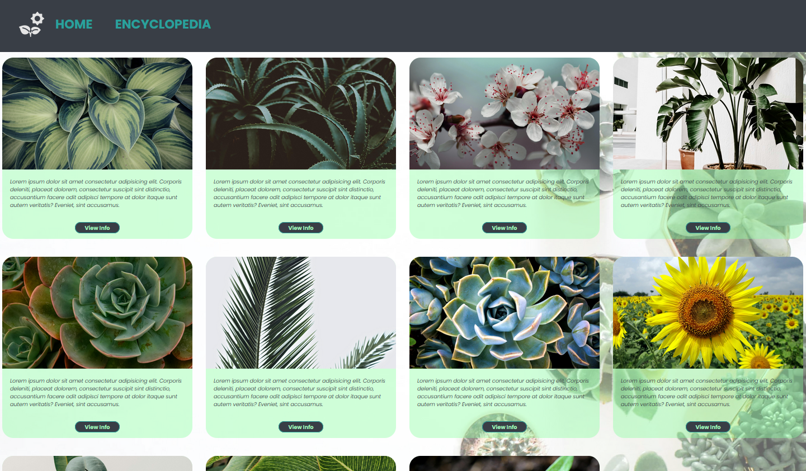

<a name="readme-top"></a>

<br />
<div align="center">
  <a href="https://github.com/othneildrew/Best-README-Template">
    
  </a>

  <h3 align="center">SBA 307-308 using JS-CSS-HTML</h3>

</div>

<!-- TABLE OF CONTENTS -->
<details>
  <summary>Table of Contents</summary>
  <ol>
    <li>
      <a href="#about-the-project">About The Project</a>
      <ul>
        <li><a href="#built-with">Built With</a></li>
      </ul>
    </li>
    <li>
      <a href="#getting-started">Getting Started</a>
      <ul>
        <li><a href="#prerequisites">Prerequisites</a></li>
        <li><a href="#installation">Installation</a></li>
      </ul>
    </li>
    <li><a href="#roadmap">Roadmap</a></li>
    <li><a href="#contributing">Contributing</a></li>
    <li><a href="#contact">Contact</a></li>
    <li><a href="#acknowledgments">Acknowledgments</a></li>
  </ol>
</details>

<!-- ABOUT THE PROJECT -->

## About The Project



<hr>

<h2>Plant Caretaking App</h2>

### Description

Simple application for home gardeners and plant caretakers who would like to keep track of their plants and caretaking schedules.

Members can explore the encyclopedia of plants, add them to their profile and enhance their caretaking experience with scheduling, tips and guidelines. Ultimately, it is an application where users can share information for increasing their ability to take care of their plants regularly.

- Implementation of adding/removing plants still in progress
- Discussions forums still in progress

### Features

- <b>User Authentication:</b> Users can register, log in and review their profile information



- <b>View catalog:</b> Users should be able to view library of plants, and explore more about them through the details. Currently no api is implemented. It will be done in future version.



<br>
<p align="right">(<a href="#readme-top">back to top</a>)</p>

### Built With

- ![css][css.com]
- ![html][html.com]
- ![javascript][js.com]

<p align="right">(<a href="#readme-top">back to top</a>)</p>

<!-- GETTING STARTED -->

## Getting Started

### Prerequisites

This is an example of how to list things you need to use the software and how to install them.

- [Spring Initializer](https://start.spring.io/)

### Installation

1. Clone the repo - Must have access first
   ```sh
    git clone https://github.com/YukiUchima/PS-TekSystemExams/tree/main/SBA/sba308-html-js
   ```
2. Node/NPM - while in correct directory, run command below

   ```sh
    live-server
   ```

3. Alternatively, run live-server in VScode

<p align="right">(<a href="#readme-top">back to top</a>)</p>

## Roadmap

- [ ] Add profile information functionality
- [ ] Add profile functionality to add/remove user plants
- [ ] Add functionality to add new registered users when submitting registration form
- [ ] Add Spring/Spring Boot
- [ ] Add API calls for plants
- [ ] Add User Accounts Database

<p align="right">(<a href="#readme-top">back to top</a>)</p>

<!-- CONTACT -->

## Contact

Project Link: [https://github.com/YukiUchima/sba308](https://github.com/YukiUchima/PS-TekSystemExams/tree/main/SBA/sba308-html-js)

<p align="right">(<a href="#readme-top">back to top</a>)</p>

<!-- ACKNOWLEDGMENTS -->

## Acknowledgments

- [Malven's Flexbox Cheatsheet](https://flexbox.malven.co/)
- [Malven's Grid Cheatsheet](https://grid.malven.co/)
- [Img Shields](https://shields.io)
- [Font Awesome](https://fontawesome.com)

[js.com]: https://img.shields.io/badge/javascript-222?style=for-the-badge&logo=javascript&logoColor=ffdd00
[css.com]: https://img.shields.io/badge/css-0066cc?style=for-the-badge&logo=css&logoColor=ffdd00
[html.com]: https://img.shields.io/badge/html-ff8000?style=for-the-badge&logo=html&logoColor=000
